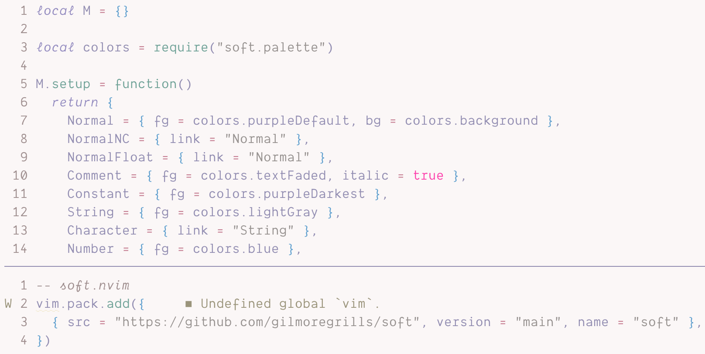

# soft

### syntax theme for [Neovim](https://www.neovim.io/)

Light pastel syntax theme based on but diverged from [soft-era](https://github.com/soft-aesthetic/soft-era), ported from [ soft-era-vim ](https://github.com/soft-aesthetic/soft-era-vim)



Copies structure from [ymir.nvim](https://github.com/Ronxvier/ymir.nvim) for theme creation with colours inspired by [ soft-era-vim ](https://github.com/soft-aesthetic/soft-era-vim) and [ soft-era-vscode ](https://github.com/soft-aesthetic/soft-era-vs-code).

Tries to support plugins that I use, which is why there are groups sections for telescope, which-key, and mini.indentscope, but if it doesn't play nicely with any other plugins then please feel free to create an issue/PR.

Also uses italics for some highlight groups, so there's that :)

## Installation

### Lazy:
```lua
{
	"gilmoregrills/soft",
	lazy = false, -- make sure we load this during startup if it is your main colorscheme
	priority = 1000, -- make sure to load this before all the other start plugins
	config = function() -- not necessary if you're setting this somewhere else
		vim.cmd([[colorscheme soft]])
	end,
},
```
